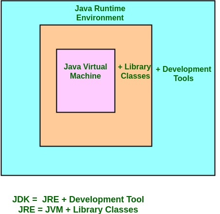

### Background

- At my workplace, we use React & Angular frontend with Java Backend. Also for E2E testing, we use Selenium Webdriver with Cucumber running on Java. With little to no knowledge of Java, I encounter bugs and logs including terms like JVM, JRE or JDK. Here are the notes where I sought understanding of what they are and their relationship is.

 

What is JVM, JRE, JDK?

 

### What is JVM (Java Virtual Machine)

- JVM acts as a run-time engine to run Java application.

- Runs/ Interprets / Translates `Bytecode` (.class files) into `Native Machine Code`

- It is responsible for executing the java program line by line hence it is also known as Interpreter.

- Contained or inbuilt in JRE & JDK. Whatever Java program you run using JRE or JDK goes into JVM

### What is JRE (Java Runtime Environment)?

- JRE is a set of components to create and run a Java application.

- It is an environment (standard libraries and JVM) required to run Java applications

- Comes in form of `.jar` file type

 

### What is JDK (Java Development Kit)?

- It is a JRE with developer tools and documentation

- It includes the JRE and a set of programming tools, such as a Java compiler, interpreter, and document viewer. The JDK is implemented through the Java SE, Java EE, or Java ME platforms.

 

---

#### Reference

- [https://stackoverflow.com/questions/7674839/is-the-jvm-a-compiler-or-an-interpreter](https://stackoverflow.com/questions/7674839/is-the-jvm-a-compiler-or-an-interpreter)
