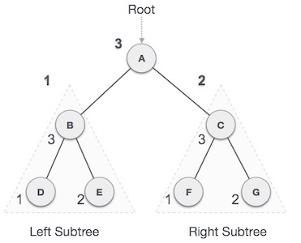
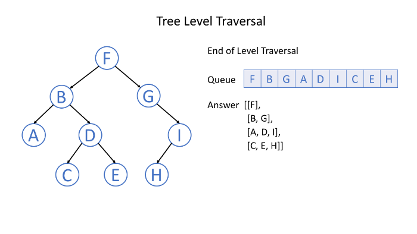

## Binary Tree Traversal

### Depth-First Search

#### Pre-order Traversal

- Pre-order traversal is to visit the root first.
  Then traverse the left subtree.
  Finally, traverse the right subtree.

*[ A → B → D → E → C → F → G ]*

**Javascript Solution**

```javascript
var preorderTraversal = function(root) {
  //corner case
  if (root == null) return []
  //declarations
  let result = []
  let stack = [root]
  while (stack.length) {
    //initially, stack.length is 1
    let pointer = stack.pop() //node pointer
    result.push(pointer.val) //insert pointed node at the end of result
    if (pointer.right) {
      stack.push(pointer.right) //stack right subtree first
    }
    if (pointer.left) {
      stack.push(pointer.left) //stack left subtree on top of right subtree
    } //iterate until stack is empty
  }
  return result
}
```

#### In-order Traversal

- In-order traversal is to traverse the left subtree first.
  Then visit the root.
  Finally, traverse the right subtree.

*[D → B → E → A → F → C → G]*

**Javascript Solution**

```javascript
var inorderTraversal = function(root) {
  //corner case
  if (root == null) return []
  //declaration
  let result = []
  let stack = []
  let pointer = root
  while (stack.length || pointer) {
    if (pointer) {
      //if pointed node is not null
      stack.push(pointer) //store pointed node at the top of stack
      pointer = pointer.left //shift pointer to left node
    } else {
      //if pointed node is null (reached the leaf)
      pointer = stack.pop() //assign extracted top stack value to pointer
      result.push(pointer.val) //insert pointed node at the end of result
      pointer = pointer.right //shift pointer to right node
    }
  }
  return result
}
```

#### Post-order Traversal

- Post-order traversal is to traverse the left subtree first.
  Then traverse the right subtree.
  Finally, visit the root.

*[D → E → B → F → G → C → A]*

**Javascript Solution**

```javascript
var postorderTraversal = function(root) {
  //corner case
  if (root == null) return []
  //declarations
  let result = []
  let stack = [root]
  while (stack.length) {
    let pointer = stack.pop() //node pointer
    result.unshift(pointer.val) //insert pointed node at the front of result
    if (pointer.left) {
      stack.push(pointer.left) //stack left subtree first
    }
    if (pointer.right) {
      stack.push(pointer.right) //stack right subtree on top of left subtree
    }
  }
  return result
}
```

### Breadth-First Search

Level-order traversal is to traverse the tree level by level.

`Breadth-First Search` is an algorithm to traverse or search in data structures like a tree or a graph. The algorithm starts with a root node and visit the node itself first. Then traverse its neighbors, traverse its second level neighbors, traverse its third level neighbors, so on and so forth.



ie. Given Binary Tree

```
    3
   / \
  9  20
    /  \
   15   7
```

returns

```
[
  [3],
  [9,20],
  [15,7]
]
```

**Javascript Solution**

```javascript
var levelOrder = function(root) {
  if (root == null) return []
  let result = []
  let queue = [root]
  while (queue.length) {
    let size = queue.length
    let temp = []
    for (i = 0; i < size; i++) {
      // iterate through # of child nodes
      let node = queue.shift() // queue uses shift vs stack uses pop (see Note)
      temp.push(node.val)
      if (node.left) {
        queue.push(node.left) // queue left subtree first
      }
      if (node.right) {
        queue.push(node.right) // queue right subtree after left subtree
      }
    }
    result.push(temp)
  }
  return result
}
```

| After                      | queue (before)      | temp      | queue (after)       | result                  |
| -------------------------- | ------------------- | --------- | ------------------- | ----------------------- |
| 1st Iteration              | [3 → •••]           | [ 3 ]     | [9 → •••, 20 → •••] | [ [3] ]                 |
| 2nd Iteration (inner loop) | [9 → •••, 20 → •••] | [ 9 ]     | [20 → •••]          | [ [3], [9] ]            |
| 2nd Iteration (inner loop) | [20 → •••]          | [ 9, 20 ] | [15 → •••, 7 → •••] | [ [3], [9,20] ]         |
| 3rd Iteration (inner loop) | [15 → •••, 7 → •••] | [ 15 ]    | [7 → •••]           | [ [3], [9,20], [15] ]   |
| 3rd Iteration (inner loop) | [7 → •••]           | [ 7 ]     | [ ]                 | [ [3], [9,20], [15,7] ] |

**Note:**

- Stack: LIFO (Last In First Out) ie. Stack of Plates
- Queue: FIFO (First In First Out) ie. Queue in the movie

---

_References:_

- _[Question Source - Leetcode](https://leetcode.com/explore/learn/card/data-structure-tree/134/traverse-a-tree/)_
- _[Data Structures: Stacks & Queues](https://www.youtube.com/watch?v=wjI1WNcIntg)_
- _[Data Structure & Algorightms - Tree Traversal](https://www.tutorialspoint.com/data_structures_algorithms/tree_traversal.htm)_