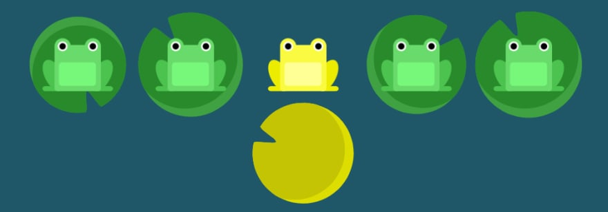
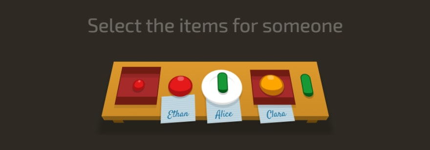

### 1. Learn CSS Flexbox

- Game: [https://flexboxfroggy.com](https://flexboxfroggy.com/)

- Contributions: [https://github.com/thomaspark/flexboxfroggy](https://github.com/thomaspark/flexboxfroggy)

- Creator: [Codepip](https://codepip.com/)

 

### 2. Learn CSS Selector Logic

- Game: [http://flukeout.github.io](http://flukeout.github.io/)

- Contributions: [https://github.com/flukeout/css-diner](https://github.com/flukeout/css-diner)

- Creator: [Luke Pacholski](https://github.com/flukeout)
